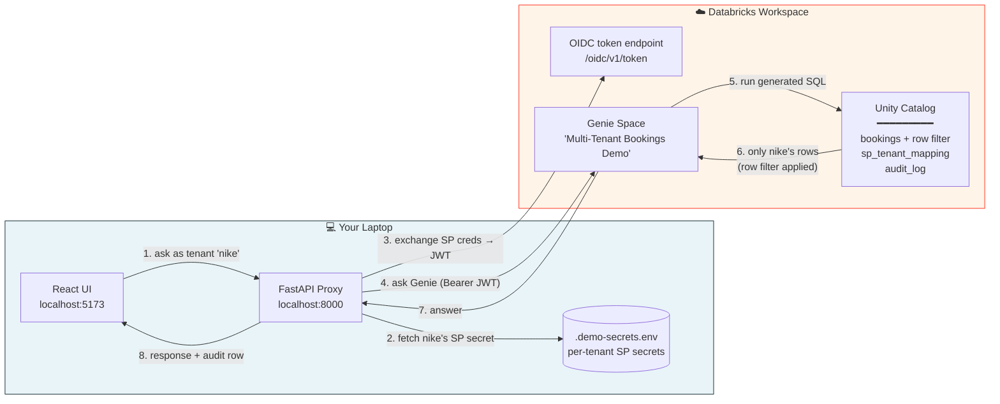

# POC Request Flow — Step-by-Step

A one-page reference for the multi-tenant Genie POC. Pull this up during a demo to walk through what happens when a customer asks a question.



> Source: [`diagrams/poc-flow.mmd`](../diagrams/poc-flow.mmd)

---

## The 8 Steps

### Step 1 — UI sends the question

`POST http://localhost:8000/api/genie/ask`

```json
{ "tenant_id": "nike", "question": "How many bookings last month?" }
```

**What's happening:** The React UI (or any HTTP client) hits the proxy with two things: which tenant the question is for, and the natural-language question. In production, the customer wouldn't pass `tenant_id` — they'd pass an API key, and the proxy would resolve the key → tenant_id internally. The demo skips that step for clarity.

**What to say:** *"This is the customer-facing API. In production it would take an API key, not a tenant_id — but the principle is the same: customer in, answer out."*

---

### Step 2 — Proxy fetches the tenant's SP credentials

The proxy reads `.demo-secrets.env` to find Nike's OAuth client_secret. The `client_id` (Nike's SP `application_id`) lives in the `tenants` table in Unity Catalog.

```
MT_GENIE_SECRET_NIKE=<oauth-client-secret>
```

**What's happening:** Each customer has its own Databricks Service Principal — a non-human Databricks identity with its own OAuth credentials. The proxy keeps a directory of them. In the POC this is a flat file; in production it would be Lakebase, Vault, or a secret manager with AES-256-GCM encryption at rest.

**What to say:** *"Each customer has its own service principal — its own Databricks identity. We store the credentials encrypted and look them up per-request."*

---

### Step 3 — Proxy mints an OAuth JWT for the SP

```http
POST https://<workspace>.cloud.databricks.com/oidc/v1/token
Authorization: Basic base64(client_id:client_secret)
Content-Type: application/x-www-form-urlencoded

grant_type=client_credentials&scope=all-apis
```

**What's happening:** Standard OAuth 2.0 client_credentials grant. The proxy hands over Nike's SP credentials and gets back a JWT that's valid for ~1 hour. The proxy caches this JWT per-SP and refreshes 5 min before expiry — at scale, caching saves thousands of redundant token mints per minute.

**What to say:** *"Standard OAuth machine-to-machine flow. The token we get back is the only thing Databricks sees from this point on — and it carries Nike's SP identity, nothing else."*

---

### Step 4 — Proxy calls the Genie Conversation API

```http
POST https://<workspace>.cloud.databricks.com/api/2.0/genie/spaces/{space_id}/start-conversation
Authorization: Bearer <JWT-from-step-3>
Content-Type: application/json

{ "content": "How many bookings last month?" }
```

**What's happening:** The proxy forwards the question to Genie, authenticated as Nike's SP. Genie sees the SP identity in the JWT — it does NOT see "nike" as a tenant name. To Genie, this is just an authorized service principal asking a question.

**What to say:** *"Genie has no idea this is a multi-tenant system. It thinks one service principal is asking a question. The isolation magic happens further down."*

---

### Step 5 — Genie generates SQL and runs it on the warehouse

Genie's LLM converts the question into SQL, e.g.:

```sql
SELECT COUNT(*) AS total_bookings
FROM serverless_jsr0s9_catalog.mt_genie_demo.bookings
WHERE booked_at >= DATE_TRUNC('MONTH', CURRENT_DATE) - INTERVAL 1 MONTH
```

The SQL has **no WHERE clause for tenant**. Genie doesn't know about tenant filtering.

**What's happening:** Genie's job is natural-language → SQL. It generates the query against the original table name — that's why row filters are preferred over views (Genie sees the real schema, which improves NL understanding).

**What to say:** *"Look at this SQL — no tenant filter, no isolation logic. Genie generated the obvious query. The isolation is about to be added by Unity Catalog, not by Genie."*

---

### Step 6 — Unity Catalog applies the row filter (the moment that matters)

Before returning rows from `bookings`, Unity Catalog evaluates the row filter function bound to the table:

```sql
CREATE OR REPLACE FUNCTION tenant_row_filter(tenant_id STRING)
RETURN
  is_account_group_member('admins')
  OR EXISTS (
    SELECT 1
    FROM sp_tenant_mapping m
    WHERE m.sp_app_id = session_user()         -- the SP's application_id
      AND m.active = true
      AND m.tenant_id = tenant_row_filter.tenant_id
  );
```

Substituting Nike's identity:
- `session_user()` returns Nike's SP application_id
- The mapping table has one row: `(sp_app_id=Nike's SP, tenant_id='nike', active=true)`
- The filter returns `true` only for rows where `bookings.tenant_id = 'nike'`
- All other tenants' rows are silently dropped before they leave UC

**What's happening:** This is the deterministic enforcement point. The filter is bound to the *table*, not the query — so it applies to every read of `bookings`, regardless of who's asking or what SQL was generated. Even an admin opening the SQL Editor would see this filter (unless they're in the `admins` group).

**What to say (the "aha" moment):** *"This is the only line of defense, and the only one we need. The filter is on the table, not the query. Genie can't bypass it. The SQL Editor can't bypass it. A buggy app can't bypass it. Unity Catalog itself enforces it before any byte leaves the storage layer."*

---

### Step 7 — Genie packages the answer

Genie receives the (already-filtered) result rows from the warehouse, generates a natural-language answer, and returns the message to the proxy.

```json
{
  "status": "COMPLETED",
  "attachments": [
    { "query": { "query": "SELECT COUNT(*) ..." } },
    { "text": { "content": "There were 47 bookings last month." } }
  ]
}
```

**What's happening:** Genie's response includes the SQL it generated, the result rows, and a natural-language summary. The proxy can choose what to surface to the customer — typically the answer text + the result table; we usually hide the raw SQL from end users.

**What to say:** *"The answer Genie sends back was built from rows it could actually see — Nike's rows only. There was never a moment where another tenant's data was in memory in Genie's pipeline."*

---

### Step 8 — Proxy returns the answer and writes an audit row

The proxy returns the answer to the UI and writes one row to `audit_log` capturing tenant, question, latency, status:

```sql
INSERT INTO audit_log
  (event_time, actor, tenant_id, action, sp_app_id, question, latency_ms, status)
VALUES (NOW(), 'rohit@databricks.com', 'nike', 'query',
        'a6fe1b42-cdb3-...', 'How many bookings last month?', 8531, 'ok');
```

**What's happening:** Every customer query is captured with full attribution. This is independent of Databricks' own audit logs (which see only "the SP made a query") — the proxy adds the tenant context that Databricks can't see, since at the Databricks layer all queries look like "an SP queried bookings."

**What to say:** *"This is your customer-attribution layer. Databricks audit captures 'SP X ran query Y'. Our app audit adds 'and SP X represents tenant Nike, asking this customer-facing question, on behalf of API key K'. Together they give you a complete forensic trail."*

---

## The Three Things to Repeat

If you remember nothing else:

1. **Genie has no idea this is multi-tenant.** It just authenticates as a service principal and asks the warehouse for data.
2. **Unity Catalog's row filter is the deterministic enforcement.** Bound to the table, not the query — impossible for the LLM to bypass.
3. **The mapping table is the indirection that makes onboarding/offboarding tractable.** To add a customer: insert one row. To remove: flip `active=false`. No UC objects need to change.

## Common Questions

> **"What if Genie generates `SELECT * FROM bookings WHERE tenant_id = 'someone-else'`?"**
> Doesn't matter. The row filter is evaluated AFTER Genie's WHERE. UC will return zero rows because `someone-else` isn't in the mapping for this SP.

> **"What if the customer's API key is leaked?"**
> The customer's API key is your concern, not Databricks'. The leaked key would let the attacker impersonate that one tenant — same blast radius as if they'd guessed the customer's password. The Databricks layer is unaffected.

> **"What if the SP's OAuth secret is leaked?"**
> Bigger problem. The attacker can mint tokens as that SP and query that tenant's data. Mitigation: rotate the secret immediately (built into the demo), monitor for anomalous query patterns, and if the breach is broad, rotate every SP. This is why we recommend short rotation cycles in production.

> **"What if I want to add a new tenant?"**
> Three things: create a Service Principal (one API call), insert a row into `sp_tenant_mapping` (one SQL statement), grant the SP `CAN_RUN` on the Genie space (one PATCH). The bulk script does all three for ~10s/tenant.

> **"Will this work without my app — e.g., a customer querying directly via JDBC?"**
> Yes. The row filter applies to every read of the table, regardless of how SQL arrives at the warehouse. JDBC clients authenticated as a tenant SP would see the same filtered view.
