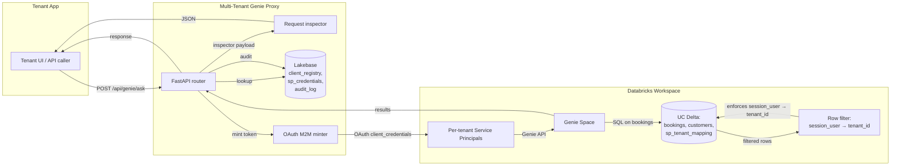

# Phase 3 — UI Rebuild Implementation Plan

> **For agentic workers:** REQUIRED SUB-SKILL: Use superpowers:subagent-driven-development (recommended) or superpowers:executing-plans to implement this plan task-by-task. Steps use checkbox (`- [ ]`) syntax for tracking.

**Goal:** Rebuild the React UI on top of the Phase 2 API surface — rename Client→Demo, build the request-flow `Inspector` (the hero feature), `BulkOnboardDialog`, `VerifyIsolationModal`, `TenantHistoryDrawer`, `NumbersStrip`; rewire `AdminPage`; rewrite `ArchitecturePage`. Three-tab IA: Demo · Admin · Architecture.

**Architecture:** Pure frontend work. New components live in `web/src/components/`. The api client (`web/src/lib/api.ts`) gains the new endpoints. Pages import the new components. No existing primitive (`web/src/components/ui/*`) is changed; we use Dialog for both modals and the "history drawer" (no separate Sheet primitive needed).

Design rule: **credible, not gimmicky.** No animations beyond 100ms fades. Plain copy ("Apply row filter", not "✨ The magic happens here"). Inspector collapsed by default. Static amber accent on step ④. No pulses, no shimmers.

**Tech Stack:** React 18, TypeScript, Vite, Tailwind CSS, shadcn/ui (Card, Dialog, Table, Button, Badge, Alert, Input, Select, Textarea), lucide-react icons, @tanstack/react-query for data fetching, recharts for sparklines, mermaid for the architecture diagram. No Vitest, no Playwright tests in CI — verification is `npx tsc --noEmit` plus manually booting the dev server.

**Working tree assumed at start:** branch `generalize-and-scale` at the head of Phase 2 (`2430f4c`). Clean working tree. Backend tests 30 passed + 18 skipped.

---

## Task 1: Update `web/src/lib/api.ts` for the Phase 2 endpoints

The api client today references endpoints that have moved (`/tenants/audit` → `/audit`, `/tenants/mapping` → `/audit/mapping`) and is missing the new ones (bulk, jobs, reactivate, delete, history, verify, inspector). Also: the `AuditRow` shape changed in Phase 2 (now matches Lakebase's `audit_log` columns).

**Files:**
- Modify: `web/src/lib/api.ts` (full rewrite of the types and the `api` object)

- [ ] **Step 1: Replace the contents of `web/src/lib/api.ts`**

```typescript
const BASE = "/api";

// ============================================================================
// Types
// ============================================================================

export interface Tenant {
  tenant_id: string;
  tenant_name: string;
  sp_app_id: string;
  sp_display_name: string;
  status: "active" | "rotating" | "deactivated" | string;
  created_at: string;
  updated_at: string;
}

export interface WorkspaceInfo {
  host: string;
  catalog: string;
  schema_name: string;
  genie_space_id: string;
  warehouse_name: string;
  admin_group: string;
}

export interface InspectorStep {
  n: number;
  name: string;
  summary: string | null;
  code_snippet: string | null;
  payload_in: Record<string, unknown> | null;
  payload_out: Record<string, unknown> | null;
  duration_ms: number;
  error: string | null;
}

export interface InspectorPayload {
  request_id: string;
  steps: InspectorStep[];
}

export interface AskResponse {
  tenant_id: string;
  tenant_name: string;
  sp_app_id: string;
  question: string;
  answer_text: string | null;
  sql: string | null;
  columns: string[];
  rows: (string | number | null)[][];
  latency_ms: number;
  conversation_id: string | null;
  message_id: string | null;
  status: string;
  inspector: InspectorPayload | null;
}

export interface AuditRow {
  id: number;
  tenant_id: string | null;
  actor: string | null;
  action: string;
  sp_app_id: string | null;
  question: string | null;
  status: string;
  latency_ms: number | null;
  detail: string | null;
  created_at: string;
}

export interface MappingRow {
  sp_app_id: string;
  tenant_id: string;
  active: boolean;
}

export interface OnboardResponse {
  tenant: Tenant;
  client_id: string;
  client_secret: string;
}

export interface RotateResponse {
  tenant_id: string;
  new_client_secret: string;
}

export interface BulkOnboardInput {
  tenant_id: string;
  tenant_name: string;
}

export interface BulkOnboardResponse {
  job_id: string;
}

export interface BulkOnboardJobError {
  tenant_id: string;
  error: string;
}

export interface BulkOnboardJobResult {
  tenant_id: string;
  tenant_name: string;
  sp_app_id: string;
  client_secret: string;
}

export interface JobStatus {
  job_id: string;
  state: "running" | "completed" | string;
  total: number;
  processed: number;
  errors: BulkOnboardJobError[];
  results: BulkOnboardJobResult[];
}

export interface VerifyResultRow {
  tenant_id: string;
  tenant_name: string;
  passed: boolean;
  distinct_tenant_ids: string[];
  visible_row_count: number | null;
  error: string | null;
}

// ============================================================================
// HTTP helper
// ============================================================================

async function http<T>(path: string, init?: RequestInit): Promise<T> {
  const res = await fetch(`${BASE}${path}`, {
    headers: { "Content-Type": "application/json" },
    ...init,
  });
  if (!res.ok) {
    const text = await res.text().catch(() => "");
    throw new Error(`${res.status} ${res.statusText}${text ? `: ${text}` : ""}`);
  }
  return res.json();
}

// ============================================================================
// API surface
// ============================================================================

export const api = {
  // Workspace info
  workspace: () => http<WorkspaceInfo>("/workspace/info"),

  // Tenants — list + lifecycle
  tenants: () => http<Tenant[]>("/tenants"),
  onboard: (tenant_id: string, tenant_name: string) =>
    http<OnboardResponse>("/tenants/onboard", {
      method: "POST",
      body: JSON.stringify({ tenant_id, tenant_name }),
    }),
  bulkOnboard: (tenants: BulkOnboardInput[]) =>
    http<BulkOnboardResponse>("/tenants/bulk", {
      method: "POST",
      body: JSON.stringify({ tenants }),
    }),
  rotate: (tenant_id: string) =>
    http<RotateResponse>(
      `/tenants/${encodeURIComponent(tenant_id)}/rotate`,
      { method: "POST" },
    ),
  deactivate: (tenant_id: string) =>
    http<{ ok: boolean }>(
      `/tenants/${encodeURIComponent(tenant_id)}/deactivate`,
      { method: "POST" },
    ),
  reactivate: (tenant_id: string) =>
    http<RotateResponse>(
      `/tenants/${encodeURIComponent(tenant_id)}/reactivate`,
      { method: "POST" },
    ),
  delete: (tenant_id: string) =>
    http<{ ok: boolean }>(
      `/tenants/${encodeURIComponent(tenant_id)}`,
      { method: "DELETE" },
    ),
  history: (tenant_id: string, limit = 50) =>
    http<AuditRow[]>(
      `/tenants/${encodeURIComponent(tenant_id)}/history?limit=${limit}`,
    ),

  // Jobs
  job: (job_id: string) => http<JobStatus>(`/jobs/${encodeURIComponent(job_id)}`),

  // Audit + mapping (moved out of /tenants in Phase 2)
  audit: (limit = 50) => http<AuditRow[]>(`/audit?limit=${limit}`),
  mapping: () => http<MappingRow[]>("/audit/mapping"),

  // Verify
  verify: () => http<VerifyResultRow[]>("/verify", { method: "POST" }),

  // Genie
  ask: (
    tenant_id: string,
    question: string,
    options?: { conversation_id?: string | null; inspect?: boolean },
  ) => {
    const url = options?.inspect ? "/genie/ask?inspect=true" : "/genie/ask";
    return http<AskResponse>(url, {
      method: "POST",
      body: JSON.stringify({
        tenant_id,
        question,
        conversation_id: options?.conversation_id ?? null,
      }),
    });
  },
  sweep: (question: string) =>
    http<AskResponse[]>("/genie/sweep", {
      method: "POST",
      body: JSON.stringify({ question }),
    }),
};
```

- [ ] **Step 2: Verify TypeScript compiles**

```bash
cd web && npx tsc --noEmit 2>&1 | grep -v zoxide
```

Expected: at most the pre-existing `'primaryMetric' is declared but its value is never read` warning in `ClientPage.tsx`. Anything new is a real failure.

You will probably see new errors from `ClientPage.tsx` and `AdminPage.tsx` because they reference fields that the new types don't have (e.g. `r.event_time`). That's expected — those pages get rewritten in later tasks. Note them but don't fix them yet.

If tsc fails with errors that are NOT in `ClientPage.tsx` or `AdminPage.tsx`, fix them now (they indicate a real breakage in the api.ts rewrite).

- [ ] **Step 3: Commit**

```bash
git add web/src/lib/api.ts
git commit -m "Update api.ts for Phase 2 endpoints + InspectorPayload type"
```

---

## Task 2: Update App.tsx — tab labels and minor cleanup

Three tabs total — rename "Client View" to "Demo". Drop the "POC" badge from the header (we're a reference solution now). Rename the workspace badge from `space …` to a more honest label.

**Files:**
- Modify: `web/src/App.tsx`

- [ ] **Step 1: Open `web/src/App.tsx` and apply these changes**

Find this line:

```tsx
                <Badge
                  variant="secondary"
                  className="text-[10px] font-medium bg-indigo-50 text-indigo-700 border-indigo-100"
                >
                  POC
                </Badge>
```

Replace with:

```tsx
                <Badge
                  variant="secondary"
                  className="text-[10px] font-medium bg-indigo-50 text-indigo-700 border-indigo-100"
                >
                  Reference
                </Badge>
```

Find:

```tsx
          <TabsList className="bg-white shadow-sm border">
            <TabsTrigger value="client">Client View</TabsTrigger>
            <TabsTrigger value="admin">Admin</TabsTrigger>
            <TabsTrigger value="architecture">Architecture</TabsTrigger>
          </TabsList>

          <TabsContent value="client">
            <ClientPage />
          </TabsContent>
```

Replace with:

```tsx
          <TabsList className="bg-white shadow-sm border">
            <TabsTrigger value="demo">Demo</TabsTrigger>
            <TabsTrigger value="admin">Admin</TabsTrigger>
            <TabsTrigger value="architecture">Architecture</TabsTrigger>
          </TabsList>

          <TabsContent value="demo">
            <DemoPage />
          </TabsContent>
```

Also find `defaultValue="client"` in the `<Tabs>` element and replace with `defaultValue="demo"`.

Find the import line:

```tsx
import { ClientPage } from "@/pages/ClientPage";
```

Replace with:

```tsx
import { DemoPage } from "@/pages/DemoPage";
```

Find the footer line:

```tsx
          Pattern A — SP per client org · UC row filters · Databricks OAuth M2M
```

Replace with:

```tsx
          Pattern A — SP per tenant · UC row filters · Databricks OAuth M2M
```

- [ ] **Step 2: TypeScript check**

```bash
cd web && npx tsc --noEmit 2>&1 | grep -v zoxide | grep -v ClientPage.tsx | head -10
```

Expected output may include `Cannot find module '@/pages/DemoPage'` — that's expected; Task 3 does the file rename. As long as the only file-not-found errors are about `DemoPage`, you're fine.

- [ ] **Step 3: Commit**

```bash
git add web/src/App.tsx
git commit -m "App.tsx: rename Client View → Demo, POC → Reference"
```

---

## Task 3: Rename `ClientPage.tsx` → `DemoPage.tsx`

Pure file rename + update the export name. No behavior change.

**Files:**
- Rename: `web/src/pages/ClientPage.tsx` → `web/src/pages/DemoPage.tsx`

- [ ] **Step 1: Rename the file via git**

```bash
git mv web/src/pages/ClientPage.tsx web/src/pages/DemoPage.tsx
```

- [ ] **Step 2: Update the export name**

In `web/src/pages/DemoPage.tsx`, find:

```tsx
export function ClientPage() {
```

Replace with:

```tsx
export function DemoPage() {
```

- [ ] **Step 3: Confirm `ClientPage` is gone from the codebase**

```bash
grep -rn "ClientPage" web/src && echo "FOUND" || echo "clean"
```

Expected: `clean`.

- [ ] **Step 4: TypeScript check**

```bash
cd web && npx tsc --noEmit 2>&1 | grep -v zoxide | head -20
```

Expected: any leftover errors should be only in `DemoPage.tsx` and `AdminPage.tsx` because they reference old api.ts fields. Those get fixed in Tasks 5 and 10.

- [ ] **Step 5: Commit**

```bash
git add web/src
git commit -m "Rename ClientPage.tsx to DemoPage.tsx"
```

---

## Task 4: Build `Inspector.tsx` component

The hero feature. Six-step horizontal strip + expansion panel. Inspector is collapsed by default; one click on a step expands the detail panel below.

Design rules (from spec):
- Static amber accent on step ④ "Apply row filter" (not pulsing).
- 100 ms fade-in on the expansion panel; no other animations.
- Plain copy.
- All steps render even when `summary`/`code_snippet`/`payload_in/out` are null — show "—" for missing.

**Files:**
- Create: `web/src/components/Inspector.tsx`

- [ ] **Step 1: Create `web/src/components/Inspector.tsx`**

```tsx
import { useState } from "react";
import type { InspectorPayload } from "@/lib/api";
import { cn } from "@/lib/utils";

interface InspectorProps {
  payload: InspectorPayload;
}

const ROW_FILTER_STEP_NAME = "Apply row filter";

export function Inspector({ payload }: InspectorProps) {
  const [openStep, setOpenStep] = useState<number | null>(null);

  return (
    <div className="space-y-3">
      <div className="flex items-center justify-between">
        <div className="text-xs font-medium uppercase tracking-wider text-muted-foreground">
          Request flow inspector
        </div>
        <div className="text-[10px] font-mono text-muted-foreground">
          req_{payload.request_id.slice(0, 8)}
        </div>
      </div>

      {/* Six-step strip */}
      <div className="grid grid-cols-2 sm:grid-cols-3 lg:grid-cols-6 gap-2">
        {payload.steps.map((step) => {
          const isOpen = openStep === step.n;
          const isHero = step.name === ROW_FILTER_STEP_NAME;
          const hasError = step.error !== null;
          return (
            <button
              key={step.n}
              type="button"
              onClick={() => setOpenStep(isOpen ? null : step.n)}
              className={cn(
                "rounded-md border px-2.5 py-2 text-left transition-colors duration-100",
                "focus:outline-none focus:ring-2 focus:ring-offset-1",
                hasError
                  ? "border-rose-300 bg-rose-50 hover:bg-rose-100 focus:ring-rose-300"
                  : isHero
                  ? "border-amber-300 bg-amber-50 hover:bg-amber-100 focus:ring-amber-300"
                  : "border-slate-200 bg-white hover:bg-slate-50 focus:ring-slate-300",
                isOpen && "ring-2 ring-offset-1",
                isOpen && (hasError
                  ? "ring-rose-300"
                  : isHero
                  ? "ring-amber-300"
                  : "ring-slate-300"),
              )}
            >
              <div className="flex items-baseline gap-1.5 text-[10px] font-mono text-muted-foreground">
                <span>{`step ${step.n}`}</span>
                <span className="ml-auto">
                  {hasError ? "error" : `${step.duration_ms} ms`}
                </span>
              </div>
              <div className="mt-1 text-xs font-medium leading-tight">
                {step.name}
              </div>
            </button>
          );
        })}
      </div>

      {/* Expansion panel */}
      {openStep !== null && (
        <ExpansionPanel step={payload.steps.find((s) => s.n === openStep)!} />
      )}
    </div>
  );
}

function ExpansionPanel({ step }: { step: InspectorPayload["steps"][number] }) {
  return (
    <div
      className="rounded-md border bg-white p-4 space-y-3 animate-[fadeIn_100ms_ease-out]"
      style={{ animation: "fadeIn 100ms ease-out" }}
    >
      <div className="flex items-baseline justify-between">
        <div className="text-sm font-semibold">
          {`Step ${step.n} — ${step.name}`}
        </div>
        <div className="text-[11px] font-mono text-muted-foreground">
          {step.error ? "error" : `${step.duration_ms} ms`}
        </div>
      </div>

      {step.error ? (
        <div className="text-xs text-rose-700 bg-rose-50 border border-rose-200 rounded px-3 py-2 font-mono whitespace-pre-wrap break-all">
          {step.error}
        </div>
      ) : null}

      <Field label="Summary" value={step.summary} />
      <CodeField label="Code" value={step.code_snippet} />
      <PayloadField label="Input payload" value={step.payload_in} />
      <PayloadField label="Output payload" value={step.payload_out} />
    </div>
  );
}

function Field({ label, value }: { label: string; value: string | null }) {
  return (
    <div>
      <div className="text-[10px] font-medium uppercase tracking-wider text-muted-foreground">
        {label}
      </div>
      <div className="text-xs mt-0.5 text-slate-800">{value ?? "—"}</div>
    </div>
  );
}

function CodeField({ label, value }: { label: string; value: string | null }) {
  if (!value) return <Field label={label} value={null} />;
  return (
    <div>
      <div className="text-[10px] font-medium uppercase tracking-wider text-muted-foreground">
        {label}
      </div>
      <pre className="mt-0.5 text-[11px] bg-slate-50 border border-slate-200 rounded px-3 py-2 overflow-x-auto whitespace-pre-wrap break-all font-mono text-slate-800">
        {value}
      </pre>
    </div>
  );
}

function PayloadField({
  label,
  value,
}: {
  label: string;
  value: Record<string, unknown> | null;
}) {
  if (!value || Object.keys(value).length === 0) {
    return <Field label={label} value={null} />;
  }
  return (
    <div>
      <div className="text-[10px] font-medium uppercase tracking-wider text-muted-foreground">
        {label}
      </div>
      <pre className="mt-0.5 text-[11px] bg-slate-50 border border-slate-200 rounded px-3 py-2 overflow-x-auto whitespace-pre-wrap break-all font-mono text-slate-800">
        {JSON.stringify(value, null, 2)}
      </pre>
    </div>
  );
}
```

- [ ] **Step 2: Add the fade-in keyframe to `web/src/index.css`**

Open `web/src/index.css` and append (or add inside the `@layer` block for utilities — wherever fits the existing structure):

```css
@keyframes fadeIn {
  from { opacity: 0; }
  to { opacity: 1; }
}
```

If the file already has an `@layer utilities` block, place it inside. Otherwise append to the end.

- [ ] **Step 3: Confirm `cn` helper exists**

```bash
grep -n "export function cn" web/src/lib/utils.ts
```

Expected: a hit. (shadcn convention — the helper merges Tailwind classes via `clsx` + `tailwind-merge`.)

If it doesn't exist (unlikely — every shadcn install ships it), add it now:

```typescript
// web/src/lib/utils.ts (add if missing)
import { clsx, type ClassValue } from "clsx";
import { twMerge } from "tailwind-merge";

export function cn(...inputs: ClassValue[]) {
  return twMerge(clsx(inputs));
}
```

- [ ] **Step 4: TypeScript check**

```bash
cd web && npx tsc --noEmit 2>&1 | grep -v zoxide | grep -E "Inspector\.tsx" || echo "Inspector ok"
```

Expected: `Inspector ok`. (Errors elsewhere — DemoPage / AdminPage — are still expected.)

- [ ] **Step 5: Commit**

```bash
git add web/src/components/Inspector.tsx web/src/index.css web/src/lib/utils.ts
git commit -m "Add Inspector component — six-step request flow with expansion panel"
```

---

## Task 5: Wire `Inspector` into `DemoPage` + use new ask endpoint

The DemoPage currently calls `api.ask(tenant_id, question)`. Switch to `api.ask(tenant_id, question, { inspect: true })` and render the `Inspector` below the result. Also fix any field references that broke from the api.ts rewrite.

**Files:**
- Modify: `web/src/pages/DemoPage.tsx`

- [ ] **Step 1: Update the ask mutation**

Open `web/src/pages/DemoPage.tsx`. Find:

```tsx
  const ask = useMutation({
    mutationFn: () => api.ask(pick!, q),
    onSuccess: (r) => setAnswer(r),
  });
```

Replace with:

```tsx
  const ask = useMutation({
    mutationFn: () => api.ask(pick!, q, { inspect: true }),
    onSuccess: (r) => setAnswer(r),
  });
```

- [ ] **Step 2: Add the Inspector render below the result**

In `web/src/pages/DemoPage.tsx`, find where `answer` is rendered (after the result card). Add the Inspector component import at the top of the file:

```tsx
import { Inspector } from "@/components/Inspector";
```

Then locate where the answer is shown — typically inside a JSX block conditional on `answer != null`. After the answer's existing rendering (table, sql, etc.), add:

```tsx
{answer && answer.inspector && (
  <div className="mt-4">
    <Inspector payload={answer.inspector} />
  </div>
)}
```

Place this block after the existing answer display logic, inside the same conditional that renders `answer`.

If you can't find a clean place to anchor (the file may have been heavily restructured by previous tasks), search for `answer?.answer_text` or `answer.sql` and place the Inspector block adjacent to wherever the answer details render.

- [ ] **Step 3: Sweep stays without inspector**

The "sweep all tenants" path renders multiple results in a grid — don't add an Inspector to those tiles (would be visual overload). Sweep results from `api.sweep` won't have the `inspector` field populated by the backend (backend only sets it on `?inspect=true`).

If the existing code uses `sweep[i].inspector` anywhere, it will be `null` — which the component already handles via the `answer && answer.inspector &&` guard.

- [ ] **Step 4: Fix any other field references that broke**

Run TypeScript:

```bash
cd web && npx tsc --noEmit 2>&1 | grep -v zoxide | grep "DemoPage" | head -20
```

Address every error. Most likely:
- Reference to `t.has_local_secret` — already removed in Phase 1; should not exist. If it does, remove.
- Any reference to `r.event_time` — replace with `r.created_at` (audit shape changed).

Iterate until DemoPage has zero errors:

```bash
cd web && npx tsc --noEmit 2>&1 | grep -v zoxide | grep "DemoPage" || echo "DemoPage ok"
```

Expected: `DemoPage ok`.

- [ ] **Step 5: Commit**

```bash
git add web/src/pages/DemoPage.tsx
git commit -m "Wire Inspector into DemoPage; ask uses inspect=true"
```

---

## Task 6: Build `NumbersStrip.tsx`

Four small cards across the top of Admin: *Active tenants · Queries (last hour) · p95 latency (last hour) · Errors (last hour)*. Computed client-side from the audit + tenants endpoints.

**Files:**
- Create: `web/src/components/NumbersStrip.tsx`

- [ ] **Step 1: Create the component**

```tsx
import { useMemo } from "react";
import { useQuery } from "@tanstack/react-query";
import { Card, CardContent } from "@/components/ui/card";
import { Users, Activity, Timer, AlertTriangle } from "lucide-react";
import { api, type Tenant, type AuditRow } from "@/lib/api";

export function NumbersStrip() {
  const tenants = useQuery({ queryKey: ["tenants"], queryFn: api.tenants });
  const audit = useQuery({
    queryKey: ["audit", "stats"],
    queryFn: () => api.audit(500),
    refetchInterval: 8000,
  });

  const stats = useMemo(() => computeStats(tenants.data, audit.data), [
    tenants.data,
    audit.data,
  ]);

  return (
    <div className="grid grid-cols-2 sm:grid-cols-4 gap-3">
      <NumberCard
        label="Active tenants"
        value={stats.activeTenants}
        icon={Users}
        tint="text-emerald-600"
      />
      <NumberCard
        label="Queries (last hr)"
        value={stats.queriesLastHour}
        icon={Activity}
        tint="text-indigo-600"
      />
      <NumberCard
        label="p95 latency"
        value={stats.p95LatencyMs == null ? "—" : `${stats.p95LatencyMs} ms`}
        icon={Timer}
        tint="text-slate-600"
      />
      <NumberCard
        label="Errors (last hr)"
        value={stats.errorsLastHour}
        icon={AlertTriangle}
        tint={stats.errorsLastHour > 0 ? "text-rose-600" : "text-slate-400"}
      />
    </div>
  );
}

function computeStats(tenants?: Tenant[], audit?: AuditRow[]) {
  const activeTenants =
    (tenants ?? []).filter((t) => t.status === "active").length;

  const oneHourAgo = Date.now() - 60 * 60 * 1000;
  const recent = (audit ?? []).filter((r) => {
    const t = Date.parse(r.created_at);
    return Number.isFinite(t) && t >= oneHourAgo;
  });

  const queries = recent.filter((r) => r.action === "query");
  const queriesLastHour = queries.length;

  const errStatuses = new Set(["error", "failed", "rate_limited"]);
  const errorsLastHour = recent.filter((r) =>
    r.status && errStatuses.has(r.status),
  ).length;

  const latencies = queries
    .map((r) => r.latency_ms)
    .filter((v): v is number => typeof v === "number" && v > 0)
    .sort((a, b) => a - b);
  const p95LatencyMs = latencies.length
    ? latencies[Math.min(latencies.length - 1, Math.floor(latencies.length * 0.95))]
    : null;

  return { activeTenants, queriesLastHour, errorsLastHour, p95LatencyMs };
}

function NumberCard({
  label,
  value,
  icon: Icon,
  tint,
}: {
  label: string;
  value: number | string;
  icon: React.ComponentType<{ className?: string }>;
  tint?: string;
}) {
  return (
    <Card>
      <CardContent className="pt-4 pb-4 flex items-center justify-between">
        <div>
          <p className="text-[11px] uppercase tracking-wider text-muted-foreground">
            {label}
          </p>
          <p className="text-2xl font-semibold mt-0.5">{value}</p>
        </div>
        <Icon className={`h-6 w-6 ${tint ?? "text-muted-foreground/40"}`} />
      </CardContent>
    </Card>
  );
}
```

- [ ] **Step 2: TypeScript check**

```bash
cd web && npx tsc --noEmit 2>&1 | grep -v zoxide | grep "NumbersStrip" || echo "NumbersStrip ok"
```

Expected: `NumbersStrip ok`.

- [ ] **Step 3: Commit**

```bash
git add web/src/components/NumbersStrip.tsx
git commit -m "Add NumbersStrip — active tenants, queries, p95 latency, errors"
```

---

## Task 7: Build `BulkOnboardDialog.tsx`

Dialog that accepts paste-JSON or CSV, kicks off bulk via `api.bulkOnboard`, polls `api.job(job_id)` for progress, and displays per-row results when done.

**Files:**
- Create: `web/src/components/BulkOnboardDialog.tsx`

- [ ] **Step 1: Create the component**

```tsx
import { useEffect, useRef, useState } from "react";
import { useMutation, useQuery, useQueryClient } from "@tanstack/react-query";
import {
  Dialog,
  DialogContent,
  DialogDescription,
  DialogFooter,
  DialogHeader,
  DialogTitle,
  DialogTrigger,
} from "@/components/ui/dialog";
import { Button } from "@/components/ui/button";
import { Textarea } from "@/components/ui/textarea";
import { Alert, AlertDescription, AlertTitle } from "@/components/ui/alert";
import { Badge } from "@/components/ui/badge";
import { Upload, AlertCircle, CheckCircle2 } from "lucide-react";
import { api, type BulkOnboardInput, type JobStatus } from "@/lib/api";

interface BulkOnboardDialogProps {
  trigger: React.ReactNode;
}

export function BulkOnboardDialog({ trigger }: BulkOnboardDialogProps) {
  const qc = useQueryClient();
  const [open, setOpen] = useState(false);
  const [input, setInput] = useState("");
  const [parseError, setParseError] = useState<string | null>(null);
  const [parsed, setParsed] = useState<BulkOnboardInput[]>([]);
  const [jobId, setJobId] = useState<string | null>(null);

  const start = useMutation({
    mutationFn: () => api.bulkOnboard(parsed),
    onSuccess: (r) => setJobId(r.job_id),
  });

  const job = useQuery({
    queryKey: ["job", jobId],
    queryFn: () => api.job(jobId!),
    enabled: !!jobId,
    refetchInterval: (query) => {
      const data = query.state.data as JobStatus | undefined;
      return data && data.state === "completed" ? false : 500;
    },
  });

  // Re-parse on input change
  useEffect(() => {
    if (!input.trim()) {
      setParsed([]);
      setParseError(null);
      return;
    }
    try {
      setParsed(parseInput(input));
      setParseError(null);
    } catch (e) {
      setParseError((e as Error).message);
      setParsed([]);
    }
  }, [input]);

  // Refresh tenants list once the job completes
  useEffect(() => {
    if (job.data && job.data.state === "completed") {
      qc.invalidateQueries({ queryKey: ["tenants"] });
      qc.invalidateQueries({ queryKey: ["audit"] });
    }
  }, [job.data, qc]);

  function handleClose(next: boolean) {
    if (!next) {
      setInput("");
      setParsed([]);
      setParseError(null);
      setJobId(null);
    }
    setOpen(next);
  }

  return (
    <Dialog open={open} onOpenChange={handleClose}>
      <DialogTrigger asChild>{trigger}</DialogTrigger>
      <DialogContent className="max-w-2xl">
        <DialogHeader>
          <DialogTitle>Bulk onboard tenants</DialogTitle>
          <DialogDescription>
            Paste JSON (
            <code className="text-[11px] bg-slate-100 px-1 rounded">
              [{`{"tenant_id":"a","tenant_name":"A"}`}]
            </code>
            ) or CSV (
            <code className="text-[11px] bg-slate-100 px-1 rounded">
              tenant_id,tenant_name
            </code>{" "}
            header required). Each row creates an SP, mints an OAuth secret,
            and registers the mapping.
          </DialogDescription>
        </DialogHeader>

        {!jobId && (
          <div className="space-y-3 py-1">
            <Textarea
              value={input}
              onChange={(e) => setInput(e.target.value)}
              placeholder={'[\n  {"tenant_id": "acme", "tenant_name": "Acme"},\n  {"tenant_id": "globex", "tenant_name": "Globex"}\n]'}
              className="min-h-[180px] font-mono text-xs"
            />
            {parseError && (
              <Alert variant="destructive">
                <AlertCircle className="h-4 w-4" />
                <AlertDescription>{parseError}</AlertDescription>
              </Alert>
            )}
            {parsed.length > 0 && !parseError && (
              <div className="text-xs text-muted-foreground">
                Parsed {parsed.length} tenant{parsed.length === 1 ? "" : "s"}.
              </div>
            )}
          </div>
        )}

        {jobId && job.data && (
          <div className="space-y-3 py-1">
            <ProgressBar processed={job.data.processed} total={job.data.total} />
            <div className="text-xs text-muted-foreground">
              {job.data.state === "completed"
                ? `Completed: ${job.data.results.length} ok, ${job.data.errors.length} failed`
                : `Running: ${job.data.processed} / ${job.data.total}`}
            </div>
            {job.data.state === "completed" && (
              <ResultsList job={job.data} />
            )}
          </div>
        )}

        <DialogFooter>
          {!jobId ? (
            <Button
              onClick={() => start.mutate()}
              disabled={parsed.length === 0 || !!parseError || start.isPending}
            >
              <Upload className="h-4 w-4 mr-2" />
              {start.isPending ? "Starting…" : `Run on ${parsed.length}`}
            </Button>
          ) : (
            <Button
              variant="outline"
              onClick={() => handleClose(false)}
              disabled={!job.data || job.data.state !== "completed"}
            >
              {job.data?.state === "completed" ? "Close" : "Running…"}
            </Button>
          )}
        </DialogFooter>
      </DialogContent>
    </Dialog>
  );
}

function ProgressBar({ processed, total }: { processed: number; total: number }) {
  const pct = total === 0 ? 0 : Math.min(100, Math.round((processed / total) * 100));
  return (
    <div className="w-full bg-slate-200 rounded h-2 overflow-hidden">
      <div
        className="bg-indigo-500 h-full transition-[width] duration-100"
        style={{ width: `${pct}%` }}
      />
    </div>
  );
}

function ResultsList({ job }: { job: JobStatus }) {
  return (
    <div className="space-y-1 max-h-[200px] overflow-y-auto rounded border bg-white p-2">
      {job.errors.map((e) => (
        <div key={e.tenant_id} className="text-xs flex items-start gap-2">
          <AlertCircle className="h-3.5 w-3.5 text-rose-600 shrink-0 mt-0.5" />
          <span className="font-mono">{e.tenant_id}</span>
          <span className="text-rose-700 truncate">{e.error}</span>
        </div>
      ))}
      {job.results.map((r) => (
        <div key={r.tenant_id} className="text-xs flex items-center gap-2">
          <CheckCircle2 className="h-3.5 w-3.5 text-emerald-600 shrink-0" />
          <span className="font-mono">{r.tenant_id}</span>
          <Badge variant="outline" className="text-[10px]">
            {r.sp_app_id.slice(0, 12)}…
          </Badge>
        </div>
      ))}
    </div>
  );
}

function parseInput(raw: string): BulkOnboardInput[] {
  const trimmed = raw.trim();
  if (trimmed.startsWith("[") || trimmed.startsWith("{")) {
    return parseJson(trimmed);
  }
  return parseCsv(trimmed);
}

function parseJson(raw: string): BulkOnboardInput[] {
  let v: unknown;
  try {
    v = JSON.parse(raw);
  } catch (e) {
    throw new Error(`Invalid JSON: ${(e as Error).message}`);
  }
  const arr = Array.isArray(v) ? v : [v];
  const out: BulkOnboardInput[] = [];
  for (const r of arr) {
    if (!r || typeof r !== "object") {
      throw new Error("Each entry must be an object with tenant_id and tenant_name");
    }
    const o = r as Record<string, unknown>;
    const tenant_id = String(o.tenant_id ?? "").trim();
    const tenant_name = String(o.tenant_name ?? "").trim();
    if (!tenant_id || !tenant_name) {
      throw new Error("Every entry needs tenant_id and tenant_name");
    }
    out.push({ tenant_id, tenant_name });
  }
  return out;
}

function parseCsv(raw: string): BulkOnboardInput[] {
  const lines = raw.split(/\r?\n/).map((l) => l.trim()).filter(Boolean);
  if (lines.length < 2) {
    throw new Error("CSV needs a header row and at least one data row");
  }
  const header = lines[0].split(",").map((c) => c.trim().toLowerCase());
  const idIdx = header.indexOf("tenant_id");
  const nameIdx = header.indexOf("tenant_name");
  if (idIdx === -1 || nameIdx === -1) {
    throw new Error("CSV header must include tenant_id and tenant_name");
  }
  const out: BulkOnboardInput[] = [];
  for (let i = 1; i < lines.length; i++) {
    const cols = lines[i].split(",").map((c) => c.trim());
    const tenant_id = cols[idIdx];
    const tenant_name = cols[nameIdx];
    if (!tenant_id || !tenant_name) {
      throw new Error(`Row ${i + 1}: tenant_id and tenant_name required`);
    }
    out.push({ tenant_id, tenant_name });
  }
  return out;
}
```

- [ ] **Step 2: TypeScript check**

```bash
cd web && npx tsc --noEmit 2>&1 | grep -v zoxide | grep "BulkOnboardDialog" || echo "BulkOnboardDialog ok"
```

Expected: `BulkOnboardDialog ok`.

- [ ] **Step 3: Commit**

```bash
git add web/src/components/BulkOnboardDialog.tsx
git commit -m "Add BulkOnboardDialog — paste JSON/CSV, poll job, show results"
```

---

## Task 8: Build `TenantHistoryDrawer.tsx`

Per-tenant query history. Implementation: a Dialog (large, max-width) showing the last K rows from `api.history(tenant_id)`. Not a Sheet — we don't have that primitive and Dialog works fine.

**Files:**
- Create: `web/src/components/TenantHistoryDrawer.tsx`

- [ ] **Step 1: Create the component**

```tsx
import { useQuery } from "@tanstack/react-query";
import {
  Dialog,
  DialogContent,
  DialogDescription,
  DialogHeader,
  DialogTitle,
} from "@/components/ui/dialog";
import {
  Table,
  TableBody,
  TableCell,
  TableHead,
  TableHeader,
  TableRow,
} from "@/components/ui/table";
import { Badge } from "@/components/ui/badge";
import { api } from "@/lib/api";

interface TenantHistoryDrawerProps {
  tenantId: string | null;
  tenantName: string | null;
  onOpenChange: (open: boolean) => void;
}

export function TenantHistoryDrawer({
  tenantId,
  tenantName,
  onOpenChange,
}: TenantHistoryDrawerProps) {
  const open = tenantId !== null;
  const history = useQuery({
    queryKey: ["history", tenantId],
    queryFn: () => api.history(tenantId!, 50),
    enabled: open,
  });

  return (
    <Dialog open={open} onOpenChange={onOpenChange}>
      <DialogContent className="max-w-3xl">
        <DialogHeader>
          <DialogTitle>Activity for {tenantName ?? tenantId}</DialogTitle>
          <DialogDescription>
            Last 50 events from the audit log for this tenant.
          </DialogDescription>
        </DialogHeader>

        {history.isLoading && (
          <p className="text-sm text-muted-foreground">Loading…</p>
        )}
        {history.isError && (
          <p className="text-sm text-rose-700">
            {(history.error as Error).message}
          </p>
        )}
        {history.data && history.data.length === 0 && (
          <p className="text-sm text-muted-foreground">
            No activity yet for this tenant.
          </p>
        )}
        {history.data && history.data.length > 0 && (
          <div className="max-h-[440px] overflow-y-auto rounded border">
            <Table>
              <TableHeader>
                <TableRow>
                  <TableHead className="w-[140px]">When</TableHead>
                  <TableHead>Action</TableHead>
                  <TableHead>Status</TableHead>
                  <TableHead>Latency</TableHead>
                  <TableHead>Detail</TableHead>
                </TableRow>
              </TableHeader>
              <TableBody>
                {history.data.map((r) => (
                  <TableRow key={r.id}>
                    <TableCell className="text-xs whitespace-nowrap text-muted-foreground">
                      {formatTs(r.created_at)}
                    </TableCell>
                    <TableCell>
                      <Badge variant="outline">{r.action}</Badge>
                    </TableCell>
                    <TableCell>
                      <Badge
                        variant={
                          r.status === "completed" || r.status === "ok"
                            ? "default"
                            : "destructive"
                        }
                      >
                        {r.status}
                      </Badge>
                    </TableCell>
                    <TableCell className="text-xs whitespace-nowrap">
                      {r.latency_ms != null ? `${r.latency_ms} ms` : "—"}
                    </TableCell>
                    <TableCell className="text-xs text-muted-foreground truncate max-w-[300px]">
                      {r.question ?? r.detail ?? "—"}
                    </TableCell>
                  </TableRow>
                ))}
              </TableBody>
            </Table>
          </div>
        )}
      </DialogContent>
    </Dialog>
  );
}

function formatTs(iso: string): string {
  try {
    return new Date(iso).toLocaleString(undefined, {
      month: "short",
      day: "numeric",
      hour: "2-digit",
      minute: "2-digit",
    });
  } catch {
    return iso;
  }
}
```

- [ ] **Step 2: TypeScript check**

```bash
cd web && npx tsc --noEmit 2>&1 | grep -v zoxide | grep "TenantHistoryDrawer" || echo "TenantHistoryDrawer ok"
```

Expected: `TenantHistoryDrawer ok`.

- [ ] **Step 3: Commit**

```bash
git add web/src/components/TenantHistoryDrawer.tsx
git commit -m "Add TenantHistoryDrawer — per-tenant audit history"
```

---

## Task 9: Build `VerifyIsolationModal.tsx`

Dialog that runs `api.verify()` and shows the per-tenant pass/fail results.

**Files:**
- Create: `web/src/components/VerifyIsolationModal.tsx`

- [ ] **Step 1: Create the component**

```tsx
import { useState } from "react";
import { useMutation } from "@tanstack/react-query";
import {
  Dialog,
  DialogContent,
  DialogDescription,
  DialogFooter,
  DialogHeader,
  DialogTitle,
  DialogTrigger,
} from "@/components/ui/dialog";
import { Button } from "@/components/ui/button";
import {
  Table,
  TableBody,
  TableCell,
  TableHead,
  TableHeader,
  TableRow,
} from "@/components/ui/table";
import { Alert, AlertDescription } from "@/components/ui/alert";
import { Badge } from "@/components/ui/badge";
import { Shield, AlertCircle, CheckCircle2, XCircle } from "lucide-react";
import { api, type VerifyResultRow } from "@/lib/api";

interface VerifyIsolationModalProps {
  trigger: React.ReactNode;
}

export function VerifyIsolationModal({ trigger }: VerifyIsolationModalProps) {
  const [open, setOpen] = useState(false);
  const verify = useMutation({
    mutationFn: () => api.verify(),
  });

  function handleOpenChange(next: boolean) {
    if (!next) verify.reset();
    setOpen(next);
  }

  const results = verify.data ?? null;
  const passing = results?.filter((r) => r.passed).length ?? 0;
  const failing = (results?.length ?? 0) - passing;

  return (
    <Dialog open={open} onOpenChange={handleOpenChange}>
      <DialogTrigger asChild>{trigger}</DialogTrigger>
      <DialogContent className="max-w-3xl">
        <DialogHeader>
          <DialogTitle>Verify isolation</DialogTitle>
          <DialogDescription>
            Each active tenant's Service Principal queries{" "}
            <code className="text-[11px] bg-slate-100 px-1 rounded">
              SELECT DISTINCT tenant_id FROM bookings
            </code>
            . If the only visible tenant_id is its own, the row filter is
            enforcing correctly.
          </DialogDescription>
        </DialogHeader>

        {!results && !verify.isError && (
          <p className="text-sm text-muted-foreground">
            {verify.isPending
              ? "Running queries against your warehouse…"
              : "Click Run to start. Each tenant exchanges its OAuth secret for a token, then queries the bookings table."}
          </p>
        )}

        {verify.isError && (
          <Alert variant="destructive">
            <AlertCircle className="h-4 w-4" />
            <AlertDescription>
              {(verify.error as Error).message}
            </AlertDescription>
          </Alert>
        )}

        {results && (
          <div className="space-y-3">
            <div className="flex items-center gap-3 text-sm">
              <Badge className="bg-emerald-100 text-emerald-800 border-0">
                <CheckCircle2 className="h-3 w-3 mr-1" />
                {passing} passing
              </Badge>
              {failing > 0 && (
                <Badge variant="destructive">
                  <XCircle className="h-3 w-3 mr-1" />
                  {failing} failing
                </Badge>
              )}
            </div>
            <div className="rounded border">
              <Table>
                <TableHeader>
                  <TableRow>
                    <TableHead>Tenant</TableHead>
                    <TableHead>Status</TableHead>
                    <TableHead>Visible tenant_ids</TableHead>
                    <TableHead>Detail</TableHead>
                  </TableRow>
                </TableHeader>
                <TableBody>
                  {results.map((r) => (
                    <ResultRow key={r.tenant_id} r={r} />
                  ))}
                </TableBody>
              </Table>
            </div>
          </div>
        )}

        <DialogFooter>
          <Button
            onClick={() => verify.mutate()}
            disabled={verify.isPending}
          >
            <Shield className="h-4 w-4 mr-2" />
            {verify.isPending ? "Running…" : results ? "Re-run" : "Run"}
          </Button>
        </DialogFooter>
      </DialogContent>
    </Dialog>
  );
}

function ResultRow({ r }: { r: VerifyResultRow }) {
  return (
    <TableRow>
      <TableCell>
        <div className="flex flex-col">
          <span className="text-sm font-medium">{r.tenant_name}</span>
          <span className="text-xs font-mono text-muted-foreground">
            {r.tenant_id}
          </span>
        </div>
      </TableCell>
      <TableCell>
        {r.passed ? (
          <Badge className="bg-emerald-100 text-emerald-800 border-0">
            <CheckCircle2 className="h-3 w-3 mr-1" />
            pass
          </Badge>
        ) : (
          <Badge variant="destructive">
            <XCircle className="h-3 w-3 mr-1" />
            fail
          </Badge>
        )}
      </TableCell>
      <TableCell className="text-xs font-mono">
        {r.distinct_tenant_ids.length === 0
          ? "—"
          : r.distinct_tenant_ids.join(", ")}
      </TableCell>
      <TableCell className="text-xs text-muted-foreground max-w-[280px] truncate">
        {r.error ? r.error : `expected ${r.tenant_id}, got ${r.distinct_tenant_ids.join(", ") || "(empty)"}`}
      </TableCell>
    </TableRow>
  );
}
```

- [ ] **Step 2: TypeScript check**

```bash
cd web && npx tsc --noEmit 2>&1 | grep -v zoxide | grep "VerifyIsolationModal" || echo "VerifyIsolationModal ok"
```

Expected: `VerifyIsolationModal ok`.

- [ ] **Step 3: Commit**

```bash
git add web/src/components/VerifyIsolationModal.tsx
git commit -m "Add VerifyIsolationModal — runs /api/verify and shows pass/fail per tenant"
```

---

## Task 10: Rewire `AdminPage.tsx`

Wire in `NumbersStrip`, `BulkOnboardDialog`, `VerifyIsolationModal`, `TenantHistoryDrawer`. Add reactivate + delete actions to the row menu. Swap the audit fetch from the legacy route to the new `/api/audit`. Delete the old StatCard row.

**Files:**
- Modify: `web/src/pages/AdminPage.tsx`

- [ ] **Step 1: Replace the file with the rewired version**

Replace the entire contents of `web/src/pages/AdminPage.tsx` with:

```tsx
import { useState } from "react";
import { useMutation, useQuery, useQueryClient } from "@tanstack/react-query";
import {
  Card,
  CardContent,
  CardDescription,
  CardHeader,
  CardTitle,
} from "@/components/ui/card";
import {
  Dialog,
  DialogContent,
  DialogDescription,
  DialogFooter,
  DialogHeader,
  DialogTitle,
  DialogTrigger,
} from "@/components/ui/dialog";
import {
  Table,
  TableBody,
  TableCell,
  TableHead,
  TableHeader,
  TableRow,
} from "@/components/ui/table";
import { Button } from "@/components/ui/button";
import { Badge } from "@/components/ui/badge";
import { Input } from "@/components/ui/input";
import { Alert, AlertDescription, AlertTitle } from "@/components/ui/alert";
import {
  UserPlus,
  RotateCw,
  Trash2,
  KeyRound,
  AlertCircle,
  CheckCircle2,
  Clock,
  History,
  Upload,
  Shield,
  Power,
  PowerOff,
} from "lucide-react";
import { api, type Tenant, type AuditRow } from "@/lib/api";
import { NumbersStrip } from "@/components/NumbersStrip";
import { BulkOnboardDialog } from "@/components/BulkOnboardDialog";
import { VerifyIsolationModal } from "@/components/VerifyIsolationModal";
import { TenantHistoryDrawer } from "@/components/TenantHistoryDrawer";

function statusBadge(status: string) {
  if (status === "active")
    return (
      <Badge className="bg-emerald-100 text-emerald-800 hover:bg-emerald-100 border-0">
        <CheckCircle2 className="h-3 w-3 mr-1" />
        active
      </Badge>
    );
  if (status === "deactivated")
    return (
      <Badge variant="secondary" className="bg-slate-200 text-slate-600">
        deactivated
      </Badge>
    );
  return <Badge variant="outline">{status}</Badge>;
}

function formatTs(iso: string | null | undefined) {
  if (!iso) return "—";
  try {
    return new Date(iso).toLocaleString(undefined, {
      month: "short",
      day: "numeric",
      hour: "2-digit",
      minute: "2-digit",
    });
  } catch {
    return iso;
  }
}

export function AdminPage() {
  const qc = useQueryClient();
  const tenants = useQuery({ queryKey: ["tenants"], queryFn: api.tenants });
  const audit = useQuery({
    queryKey: ["audit"],
    queryFn: () => api.audit(20),
    refetchInterval: 8000,
  });

  const [open, setOpen] = useState(false);
  const [newId, setNewId] = useState("");
  const [newName, setNewName] = useState("");
  const [lastOnboard, setLastOnboard] = useState<{
    client_id: string;
    client_secret: string;
  } | null>(null);
  const [lastSecret, setLastSecret] = useState<{
    tenant_id: string;
    new_client_secret: string;
    label: string;
  } | null>(null);
  const [historyTarget, setHistoryTarget] = useState<{
    id: string;
    name: string;
  } | null>(null);

  const onboard = useMutation({
    mutationFn: () => api.onboard(newId, newName),
    onSuccess: (d) => {
      setLastOnboard({ client_id: d.client_id, client_secret: d.client_secret });
      setNewId("");
      setNewName("");
      setOpen(false);
      qc.invalidateQueries({ queryKey: ["tenants"] });
      qc.invalidateQueries({ queryKey: ["audit"] });
    },
  });
  const rotate = useMutation({
    mutationFn: (tid: string) => api.rotate(tid),
    onSuccess: (d) => {
      setLastSecret({ ...d, label: "rotated" });
      qc.invalidateQueries({ queryKey: ["tenants"] });
      qc.invalidateQueries({ queryKey: ["audit"] });
    },
  });
  const deactivate = useMutation({
    mutationFn: (tid: string) => api.deactivate(tid),
    onSuccess: () => {
      qc.invalidateQueries({ queryKey: ["tenants"] });
      qc.invalidateQueries({ queryKey: ["audit"] });
    },
  });
  const reactivate = useMutation({
    mutationFn: (tid: string) => api.reactivate(tid),
    onSuccess: (d) => {
      setLastSecret({ ...d, label: "reactivated" });
      qc.invalidateQueries({ queryKey: ["tenants"] });
      qc.invalidateQueries({ queryKey: ["audit"] });
    },
  });
  const remove = useMutation({
    mutationFn: (tid: string) => api.delete(tid),
    onSuccess: () => {
      qc.invalidateQueries({ queryKey: ["tenants"] });
      qc.invalidateQueries({ queryKey: ["audit"] });
    },
  });

  const data = tenants.data ?? [];

  return (
    <div className="space-y-6">
      <NumbersStrip />

      {lastOnboard && (
        <Alert className="border-emerald-200 bg-emerald-50">
          <CheckCircle2 className="h-4 w-4 text-emerald-600" />
          <AlertTitle className="text-emerald-900">Tenant onboarded</AlertTitle>
          <AlertDescription className="font-mono text-xs break-all text-emerald-800">
            client_id={lastOnboard.client_id}
            <br />
            client_secret={lastOnboard.client_secret}
            <br />
            <span className="text-emerald-700/60">
              Stored encrypted in Lakebase. The Demo tab can now query Genie as this tenant.
            </span>
          </AlertDescription>
        </Alert>
      )}
      {lastSecret && (
        <Alert className="border-indigo-200 bg-indigo-50">
          <KeyRound className="h-4 w-4 text-indigo-600" />
          <AlertTitle className="text-indigo-900">
            Secret {lastSecret.label} for {lastSecret.tenant_id}
          </AlertTitle>
          <AlertDescription className="font-mono text-xs break-all text-indigo-800">
            new_client_secret={lastSecret.new_client_secret}
            <br />
            <span className="text-indigo-700/60">
              New secret active; old secrets revoked.
            </span>
          </AlertDescription>
        </Alert>
      )}

      {/* Tenants table */}
      <Card>
        <CardHeader className="flex flex-row items-center justify-between gap-4 flex-wrap">
          <div>
            <CardTitle>Tenant Service Principals</CardTitle>
            <CardDescription>
              One Databricks SP per tenant organization. Each SP's identity flows
              into{" "}
              <code className="text-[11px] bg-slate-100 px-1 rounded">
                session_user()
              </code>{" "}
              for UC row-filter enforcement.
            </CardDescription>
          </div>
          <div className="flex items-center gap-2">
            <Dialog open={open} onOpenChange={setOpen}>
              <DialogTrigger asChild>
                <Button>
                  <UserPlus className="h-4 w-4 mr-2" />
                  Onboard one
                </Button>
              </DialogTrigger>
              <DialogContent>
                <DialogHeader>
                  <DialogTitle>Onboard a new tenant</DialogTitle>
                  <DialogDescription>
                    Creates a workspace Service Principal, mints an OAuth secret,
                    stores it encrypted in Lakebase, grants SELECT/USE on the demo
                    catalog, grants CAN_RUN on the Genie Space, and inserts the
                    UC mapping row.
                  </DialogDescription>
                </DialogHeader>
                <div className="space-y-4 py-2">
                  <div>
                    <label className="text-sm font-medium">tenant_id (slug)</label>
                    <Input
                      value={newId}
                      onChange={(e) => setNewId(e.target.value)}
                      placeholder="acme"
                      className="mt-1"
                    />
                  </div>
                  <div>
                    <label className="text-sm font-medium">Display name</label>
                    <Input
                      value={newName}
                      onChange={(e) => setNewName(e.target.value)}
                      placeholder="Acme Industrial"
                      className="mt-1"
                    />
                  </div>
                  {onboard.isError && (
                    <Alert variant="destructive">
                      <AlertCircle className="h-4 w-4" />
                      <AlertDescription>
                        {(onboard.error as Error).message}
                      </AlertDescription>
                    </Alert>
                  )}
                </div>
                <DialogFooter>
                  <Button
                    onClick={() => onboard.mutate()}
                    disabled={
                      !newId.trim() || !newName.trim() || onboard.isPending
                    }
                  >
                    {onboard.isPending ? (
                      <>
                        <Clock className="h-4 w-4 mr-2 animate-spin" />
                        Onboarding…
                      </>
                    ) : (
                      <>
                        <UserPlus className="h-4 w-4 mr-2" />
                        Onboard
                      </>
                    )}
                  </Button>
                </DialogFooter>
              </DialogContent>
            </Dialog>

            <BulkOnboardDialog
              trigger={
                <Button variant="outline">
                  <Upload className="h-4 w-4 mr-2" />
                  Bulk onboard…
                </Button>
              }
            />

            <VerifyIsolationModal
              trigger={
                <Button variant="outline">
                  <Shield className="h-4 w-4 mr-2" />
                  Verify isolation
                </Button>
              }
            />
          </div>
        </CardHeader>
        <CardContent>
          {tenants.isLoading ? (
            <p className="text-sm text-muted-foreground">Loading tenants…</p>
          ) : tenants.isError ? (
            <Alert variant="destructive">
              <AlertCircle className="h-4 w-4" />
              <AlertDescription>
                {(tenants.error as Error).message}
              </AlertDescription>
            </Alert>
          ) : data.length === 0 ? (
            <p className="text-sm text-muted-foreground">
              No tenants yet. Onboard your first one above.
            </p>
          ) : (
            <Table>
              <TableHeader>
                <TableRow>
                  <TableHead>Tenant</TableHead>
                  <TableHead>Status</TableHead>
                  <TableHead>Service Principal</TableHead>
                  <TableHead>Updated</TableHead>
                  <TableHead className="text-right">Actions</TableHead>
                </TableRow>
              </TableHeader>
              <TableBody>
                {data.map((t) => (
                  <TenantRow
                    key={t.tenant_id}
                    t={t}
                    onRotate={() => rotate.mutate(t.tenant_id)}
                    onDeactivate={() => {
                      if (
                        window.confirm(
                          `Deactivate ${t.tenant_name}? The SP will be disabled and credentials dropped. The tenant_id can be reactivated later.`,
                        )
                      ) {
                        deactivate.mutate(t.tenant_id);
                      }
                    }}
                    onReactivate={() => reactivate.mutate(t.tenant_id)}
                    onDelete={() => {
                      if (
                        window.confirm(
                          `Hard delete ${t.tenant_name}? The SP, mapping row, credential, and registry row are all removed. This cannot be undone.`,
                        )
                      ) {
                        remove.mutate(t.tenant_id);
                      }
                    }}
                    onHistory={() =>
                      setHistoryTarget({ id: t.tenant_id, name: t.tenant_name })
                    }
                    rotating={
                      rotate.isPending && rotate.variables === t.tenant_id
                    }
                    deactivating={
                      deactivate.isPending && deactivate.variables === t.tenant_id
                    }
                    reactivating={
                      reactivate.isPending && reactivate.variables === t.tenant_id
                    }
                    deleting={
                      remove.isPending && remove.variables === t.tenant_id
                    }
                  />
                ))}
              </TableBody>
            </Table>
          )}
        </CardContent>
      </Card>

      {/* Audit feed */}
      <Card>
        <CardHeader>
          <CardTitle className="flex items-center gap-2">
            <History className="h-5 w-5" />
            Recent activity
          </CardTitle>
          <CardDescription>
            All admin operations and tenant queries write to{" "}
            <code>audit_log</code> in Lakebase.
          </CardDescription>
        </CardHeader>
        <CardContent>
          {audit.data && audit.data.length > 0 ? (
            <Table>
              <TableHeader>
                <TableRow>
                  <TableHead>When</TableHead>
                  <TableHead>Actor</TableHead>
                  <TableHead>Tenant</TableHead>
                  <TableHead>Action</TableHead>
                  <TableHead>Status</TableHead>
                  <TableHead>Detail</TableHead>
                </TableRow>
              </TableHeader>
              <TableBody>
                {audit.data.map((r: AuditRow) => (
                  <TableRow key={r.id}>
                    <TableCell className="whitespace-nowrap text-muted-foreground text-xs">
                      {formatTs(r.created_at)}
                    </TableCell>
                    <TableCell className="text-xs">{r.actor ?? "—"}</TableCell>
                    <TableCell className="text-xs font-medium">
                      {r.tenant_id ?? "—"}
                    </TableCell>
                    <TableCell>
                      <Badge variant="outline">{r.action}</Badge>
                    </TableCell>
                    <TableCell>
                      <Badge
                        variant={
                          r.status === "ok" || r.status === "completed"
                            ? "default"
                            : "destructive"
                        }
                      >
                        {r.status}
                      </Badge>
                    </TableCell>
                    <TableCell className="text-xs text-muted-foreground truncate max-w-[280px]">
                      {r.question ?? r.detail ?? "—"}
                    </TableCell>
                  </TableRow>
                ))}
              </TableBody>
            </Table>
          ) : (
            <p className="text-sm text-muted-foreground">No activity yet.</p>
          )}
        </CardContent>
      </Card>

      <TenantHistoryDrawer
        tenantId={historyTarget?.id ?? null}
        tenantName={historyTarget?.name ?? null}
        onOpenChange={(open) => {
          if (!open) setHistoryTarget(null);
        }}
      />
    </div>
  );
}

function TenantRow({
  t,
  onRotate,
  onDeactivate,
  onReactivate,
  onDelete,
  onHistory,
  rotating,
  deactivating,
  reactivating,
  deleting,
}: {
  t: Tenant;
  onRotate: () => void;
  onDeactivate: () => void;
  onReactivate: () => void;
  onDelete: () => void;
  onHistory: () => void;
  rotating: boolean;
  deactivating: boolean;
  reactivating: boolean;
  deleting: boolean;
}) {
  const isActive = t.status === "active";
  return (
    <TableRow>
      <TableCell>
        <div className="flex flex-col">
          <span className="font-medium">{t.tenant_name}</span>
          <span className="text-xs text-muted-foreground font-mono">
            {t.tenant_id}
          </span>
        </div>
      </TableCell>
      <TableCell>{statusBadge(t.status)}</TableCell>
      <TableCell>
        <div className="flex flex-col">
          <span className="text-xs font-mono">{t.sp_display_name}</span>
          <span
            className="text-[11px] font-mono text-muted-foreground truncate max-w-[260px]"
            title={t.sp_app_id}
          >
            {t.sp_app_id}
          </span>
        </div>
      </TableCell>
      <TableCell className="text-xs text-muted-foreground whitespace-nowrap">
        {formatTs(t.updated_at)}
      </TableCell>
      <TableCell className="text-right">
        <div className="flex gap-1 justify-end">
          <Button size="sm" variant="outline" onClick={onHistory}>
            <History className="h-3.5 w-3.5" />
            <span className="ml-1.5 hidden sm:inline">History</span>
          </Button>
          {isActive && (
            <Button
              size="sm"
              variant="outline"
              onClick={onRotate}
              disabled={rotating}
            >
              {rotating ? (
                <RotateCw className="h-3.5 w-3.5 animate-spin" />
              ) : (
                <RotateCw className="h-3.5 w-3.5" />
              )}
              <span className="ml-1.5 hidden sm:inline">Rotate</span>
            </Button>
          )}
          {isActive ? (
            <Button
              size="sm"
              variant="outline"
              className="border-amber-200 text-amber-700 hover:bg-amber-50 hover:text-amber-700"
              onClick={onDeactivate}
              disabled={deactivating}
            >
              {deactivating ? (
                <Clock className="h-3.5 w-3.5 animate-spin" />
              ) : (
                <PowerOff className="h-3.5 w-3.5" />
              )}
              <span className="ml-1.5 hidden sm:inline">Deactivate</span>
            </Button>
          ) : (
            <Button
              size="sm"
              variant="outline"
              className="border-emerald-200 text-emerald-700 hover:bg-emerald-50 hover:text-emerald-700"
              onClick={onReactivate}
              disabled={reactivating}
            >
              {reactivating ? (
                <Clock className="h-3.5 w-3.5 animate-spin" />
              ) : (
                <Power className="h-3.5 w-3.5" />
              )}
              <span className="ml-1.5 hidden sm:inline">Reactivate</span>
            </Button>
          )}
          <Button
            size="sm"
            variant="outline"
            className="border-rose-200 text-rose-700 hover:bg-rose-50 hover:text-rose-700"
            onClick={onDelete}
            disabled={deleting}
          >
            {deleting ? (
              <Clock className="h-3.5 w-3.5 animate-spin" />
            ) : (
              <Trash2 className="h-3.5 w-3.5" />
            )}
            <span className="ml-1.5 hidden sm:inline">Delete</span>
          </Button>
        </div>
      </TableCell>
    </TableRow>
  );
}
```

- [ ] **Step 2: TypeScript check**

```bash
cd web && npx tsc --noEmit 2>&1 | grep -v zoxide | head -20
```

Expected: at most the pre-existing `'primaryMetric' is declared but its value is never read` warning. If the warning is in `DemoPage.tsx` and is real (i.e., a leftover variable), fix it; if it's pre-existing, leave it.

If errors remain in `DemoPage.tsx` from earlier, address them before proceeding.

- [ ] **Step 3: Commit**

```bash
git add web/src/pages/AdminPage.tsx
git commit -m "Rewire AdminPage: NumbersStrip, bulk/verify dialogs, lifecycle actions, new audit"
```

---

## Task 11: Rewrite `ArchitecturePage.tsx` content

The current ArchitecturePage has BCD/Advito stripped (Task 2 of Phase 1) but the broader content still talks about "client organizations" and references things specific to the original POC. Make the copy generic and update the diagram to match the current architecture (Lakebase + UC).

**Files:**
- Modify: `web/src/pages/ArchitecturePage.tsx`

- [ ] **Step 1: Open `web/src/pages/ArchitecturePage.tsx` and review the existing structure**

```bash
wc -l web/src/pages/ArchitecturePage.tsx
```

The file is ~464 lines today and uses `mermaid` for diagrams + `ScriptStep` components for narrative text. We're rewriting the narrative copy and updating the mermaid diagram to reflect Lakebase as the metadata store.

- [ ] **Step 2: Apply targeted edits**

Find the page intro (search for the first `<CardTitle>` near the top of the page). Update titles, descriptions, and any narrative paragraphs to refer to "tenants" rather than "clients", and to reflect the current architecture (Lakebase for OLTP metadata, UC for governed data, Genie for queries).

Specific text replacements (apply each one wherever it appears in the file):

- Replace `client organization` with `tenant` (case-insensitive)
- Replace `client organizations` with `tenants`
- Replace `per-client` with `per-tenant`
- Replace `client SP` with `tenant SP`

Update the mermaid diagram. Find the `multi-tenant-genie-architecture.mmd` reference or the inlined diagram string. Replace the diagram with this content:



Find the existing mermaid diagram source in the file. Replace it with the diagram above. (The mermaid string is typically inside a `<Mermaid />` component or inlined as a const at the top of the file.)

- [ ] **Step 3: Update the "What's not in this reference" section**

If the file has a section listing intentional omissions, ensure it includes:
- Per-tenant rate limits / quotas (deferred)
- Cost / token tracking per tenant (deferred)
- Multi-Genie-space UI (data model accommodates it via `tenants.genie_space_id`; UI is a future spec)
- Pattern B (custom claims) — blocked on Genie support

If the section is missing, add it as a Card at the bottom of the page:

```tsx
<Card>
  <CardHeader>
    <CardTitle>Intentionally out of scope</CardTitle>
    <CardDescription>
      What this reference does <em>not</em> include — and where to add it later.
    </CardDescription>
  </CardHeader>
  <CardContent className="space-y-2 text-sm text-slate-700">
    <p>
      <strong>Per-tenant rate limits / quotas.</strong> Future spec. Add a token-bucket
      check in the proxy, persist counters in Lakebase.
    </p>
    <p>
      <strong>Cost / token tracking per tenant.</strong> Future spec. Genie API doesn't
      currently expose token cost — add when surfaced.
    </p>
    <p>
      <strong>Multi-Genie-space UI.</strong> Data model accommodates it (
      <code className="text-[11px] bg-slate-100 px-1 rounded">
        client_registry.genie_space_id
      </code>
      ); UI surface is a follow-up.
    </p>
    <p>
      <strong>Pattern B (shared SP + custom claims).</strong> Blocked on Genie surface
      validation. The architecture for it is mentioned in <code>docs/future-directions.md</code>.
    </p>
  </CardContent>
</Card>
```

Place this Card after the diagram and existing narrative content.

- [ ] **Step 4: TypeScript + dev server check**

```bash
cd web && npx tsc --noEmit 2>&1 | grep -v zoxide | head
```

Expected: clean (or at most the pre-existing primaryMetric warning).

- [ ] **Step 5: Commit**

```bash
git add web/src/pages/ArchitecturePage.tsx
git commit -m "Rewrite ArchitecturePage — generic 'tenant' framing, Lakebase in diagram, intentional-omissions section"
```

---

## Task 12: End-to-end smoke verification

Confirm everything compiles, the dev server boots, and the mock API contracts are honored.

**Files:** none (verification only)

- [ ] **Step 1: TypeScript clean build**

```bash
cd web && npx tsc --noEmit 2>&1 | grep -v zoxide
```

Expected: empty (or at most the pre-existing `primaryMetric` warning if it's still there). Anything else needs fixing.

- [ ] **Step 2: Production build**

```bash
cd web && npm run build 2>&1 | tail -10
```

Expected: build completes; `web/build/` (or the configured output dir) contains the bundled assets. Bundle warnings about chunk size are acceptable.

- [ ] **Step 3: Backend smoke unchanged**

```bash
pytest tests/test_smoke.py -v
```

Expected: 3 PASSED.

- [ ] **Step 4: Confirm new components export correctly**

```bash
grep -rn "export function" web/src/components/Inspector.tsx web/src/components/NumbersStrip.tsx web/src/components/BulkOnboardDialog.tsx web/src/components/TenantHistoryDrawer.tsx web/src/components/VerifyIsolationModal.tsx
```

Expected: one `export function` per file (Inspector, NumbersStrip, BulkOnboardDialog, TenantHistoryDrawer, VerifyIsolationModal).

- [ ] **Step 5: Confirm renamed page**

```bash
ls web/src/pages/
```

Expected: `AdminPage.tsx`, `ArchitecturePage.tsx`, `DemoPage.tsx` (no `ClientPage.tsx`).

- [ ] **Step 6: Git status + log**

```bash
git status
git log --oneline 2430f4c..HEAD
```

Expected: clean tree, ~11 new commits.

- [ ] **Step 7: Optional — boot the dev server (manual check)**

If you have time and the proxy backend can be brought up (Lakebase via docker compose + uvicorn), run:

```bash
cd web && npm run dev &
sleep 3
curl -sf http://localhost:5173 | head -5
kill %1
```

Expected: HTTP 200 with the Vite-served HTML.

If the backend isn't running, you can still confirm the SPA boots — Vite serves the static HTML even when API calls fail. Visiting the URL in a browser, you should see the three tabs render. Each tab will show "Loading…" or an error toast for API calls until the backend is up.

This step is best-effort. If your environment can't boot Vite (no node, no shell access), skip and note it.

- [ ] **Step 8: Phase 3 summary**

Write a one-paragraph summary covering:
- What got rebuilt: tab labels, DemoPage rename, Inspector (the hero), four new components (NumbersStrip / BulkOnboardDialog / TenantHistoryDrawer / VerifyIsolationModal), AdminPage rewire (lifecycle actions, audit endpoint swap), ArchitecturePage content rewrite.
- Test posture: TypeScript is the test (`npx tsc --noEmit` clean). No Vitest. Backend smoke still 3 PASSED.
- What needs live verification: anything that hits the real API + workspace + Lakebase. Suggested: bring up Docker + uvicorn + npm dev, click through each tab.
- Suggested next step: Phase 4 (deploy + docs) — `app.yaml` finalization, AES key wiring, full README, demo recording.

## Phase 3 done

When all 12 tasks are checked, the UI is feature-complete on the new IA:
- **Demo tab** — picker + ask + sample questions + sweep + Inspector inline.
- **Admin tab** — NumbersStrip + tenant table with all five lifecycle actions + bulk-onboard + verify + per-tenant history + audit feed.
- **Architecture tab** — generic "tenant" framing, Lakebase in the diagram, intentional-omissions section.

The backend is unchanged. The UI consumes only endpoints that exist in Phase 2.

Phase 4 is the last plan: `app.yaml` finalized for Databricks Apps deploy, AES-key secret wiring tested, all docs rewritten per the spec, README polish, demo recording.
